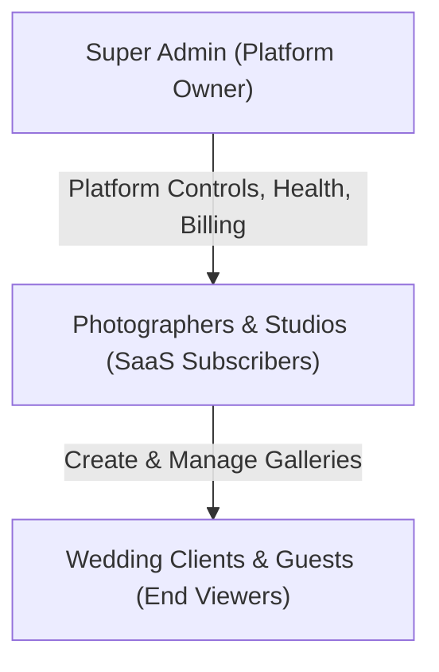
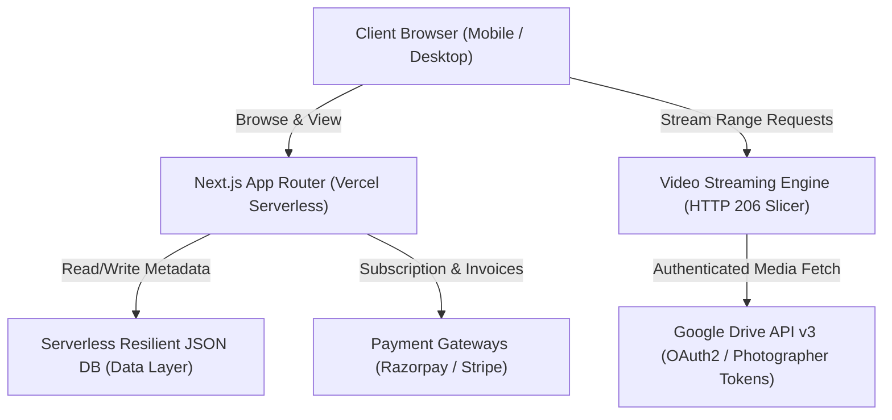

# Product Requirements Document (PRD)

# Online Video View — Luxury Wedding Media & Client Proofing SaaS

---

## 1. Executive Summary & Product Vision

**Online Video View** is a luxury wedding photography and videography delivery SaaS designed for professional wedding studios and independent creators. The platform bridges the gap between raw cloud storage (Google Drive) and a high-end, branded cinematic client experience.

### Problem Statement
- **Clunky Client Experience**: Photographers traditionally share Google Drive folders or links, exposing clients to generic cloud storage interfaces, download buttons, and confusing folder trees.
- **Google Playback Failures**: Google Drive's native embed/preview player enforces harsh unauthenticated view quotas, displaying errors such as:
  > *"Sign in to your Google Account to continue to play this video. The limit has been hit for viewers who aren't signed in."*
- **Technical Barrier for Photographers**: Other SaaS tools require photographers to configure Google Cloud Developer consoles, service accounts, and API keys.
- **Lack of Luxury Presentation**: Wedding clients expect an emotional, cinematic gallery experience with customized branding, background themes, event categorization (Haldi, Mehndi, Sangeet, Reception), and intuitive photo proofing.

### Value Proposition
- **One-Click Google Drive Connection**: Photographers sign in with Google and grant read-only access. No developer accounts or API keys required.
- **Zero-Barrier Guest Access**: Wedding guests and couples open a link with zero login, zero credentials, and zero Google accounts.
- **Direct HTML5 Video Streaming Engine**: Range-supported (HTTP 206) proxy streaming eliminates all Google Drive iframes and quota limits while supporting instant start, scrubbing, and 4K playback.
- **Luxury Cinema Experience**: Responsive client gallery with bespoke typography, music, event categorizations, photo proofing/favorite selection, and custom domain mapping.

---

## 2. User Personas & Roles

| Persona | Role | Primary Goals | Key Pain Points |
| :--- | :--- | :--- | :--- |
| **Wedding Photographer / Studio** | SaaS Subscriber (`PHOTOGRAPHER`) | Deliver films and photos in a luxury presentation, collect album selections, protect work with PINs/domains. | Spending hours uploading to multiple platforms; client complaints about playback errors. |
| **Wedding Couple & Family** | End User / Client (`CLIENT`) | Relive their wedding day with an emotional, cinematic gallery; select favorites for album printing. | Complex logins, broken video links, confusing cloud folder structures. |
| **Wedding Guests** | Viewer (`GUEST`) | Stream highlight films and browse photos effortlessly on mobile or desktop without apps or accounts. | Slow video buffering, Google sign-in prompts. |
| **Platform Administrator** | Super Admin (`SUPER_ADMIN`) | Manage subscription plans, track platform metrics, audit system health, handle support and billing. | Platform uptime monitoring, Google API quota management. |

---

## 3. System Architecture & Tech Stack

- **Frontend & Framework**: Next.js 15 (App Router), React 19, TypeScript, Tailwind CSS, Lucide Icons.
- **Video Engine**: Custom HTML5 luxury cinema player, HTTP 206 Partial Content byte-slicing proxy, 15-minute confirmation token caching.
- **Authentication**: JWT cookie-based signed sessions, Google OAuth 2.0 (`openid`, `email`, `profile`, `https://www.googleapis.com/auth/drive.readonly`).
- **Data Persistence**: Serverless-resilient atomic storage engine with `/tmp` synchronization for Vercel deployment compatibility and JSON store snapshots.
- **Hosting & Infrastructure**: Vercel Edge/Serverless, Node.js runtime.

---

## 4. Key Functional Modules & Requirements

### 4.1. Photographer Authentication & Onboarding
1. **Google OAuth 2.0 Sign-In**:
   - One-click Google Login and Signup requesting `https://www.googleapis.com/auth/drive.readonly` with offline access (`prompt=consent`).
   - Automatically stores `accessToken`, `refreshToken`, and expiration to the database.
   - Refreshes tokens automatically in the background via `oauth2Client.on("tokens")`.
2. **Email & Password Authentication**:
   - Secure registration, bcrypt password hashing, email verification, and password reset flows.
   - Direct "Connect Google Drive" button in Studio Settings/Onboarding.

### 4.2. Project Creation & Drive Link Import
1. **Drive Link Parser**:
   - Accepts Google Drive folder links (`/drive/folders/FOLDER_ID`), shared links, and single file URLs (`/file/d/FILE_ID/view`).
2. **Intelligent Drive Scanning**:
   - Recursively traverses subfolders and automatically organizes media into events (e.g., *Haldi*, *Mehndi*, *Wedding*, *Reception*, *Highlights*).
   - Identifies MIME types and extensions for photos (`.jpg`, `.png`, `.heic`, `.webp`) and videos (`.mp4`, `.mov`, `.mkv`, `.webm`).
   - Captures thumbnail previews and file size metadata.

### 4.3. Client Video Streaming Engine
1. **Zero Google Branding**:
   - Real HTML5 `<video>` element with custom cinema UI controls.
   - Absolutely no Google Drive `<iframe>`, `/preview`, or Google Drive UI overlays.
2. **Range-Supported Byte Slicing (HTTP 206)**:
   - Endpoint: `/api/videos/[videoId]/stream`.
   - Supports `Range: bytes=START-END` for instant start, smooth scrubbing, and duration discovery.
   - Streams directly from Google Drive API v3 `alt=media` using the photographer's authenticated access token.
   - Vercel Serverless streaming without buffering large gigabyte files into server RAM.
3. **Luxury Cinema Player Features**:
   - Play/Pause, ±10s skip buttons, timeline progress scrubber with hover timestamps.
   - Playback speed selection (`0.5x`, `1.0x`, `1.25x`, `1.5x`, `2.0x`).
   - Volume slider & mute toggle, fullscreen mode, next/previous film navigation.
   - Auto-hiding controls (3s idle timer during active playback).

### 4.4. Client Wedding Gallery Experience
1. **Hero Section & Cover**:
   - Couple names, wedding date, venue, custom subtitle, background cover image/video.
2. **Event Filter Navigation**:
   - Dynamic tabs for each wedding ceremony (*All*, *Haldi*, *Mehndi*, *Wedding*, *Reception*).
3. **Photo Grid & Lightbox**:
   - Masonry or justified grid layout.
   - High-resolution modal lightbox with zoom, swipe gestures, and download capability.
4. **Client Album Proofing / Favorites**:
   - Clients can favorite photos/films.
   - Set maximum selection limits with submission validation.
   - Export selections to CSV / Lightroom text format for the photographer.
5. **Access Protection**:
   - Private galleries secured by 4-digit or 6-digit PIN / Access Code.
   - Public links for shareable guest galleries.

### 4.5. Studio Branding & Custom Domains
1. **Custom Branding**:
   - Studio logo, favicon, primary/accent color scheme, typography presets.
   - Watermark protection on preview images.
2. **Custom Domain Mapping**:
   - Support for custom domains (e.g., `gallery.drfilms.in`).
   - Automated DNS CNAME verification, SSL certificate lifecycle handling, and primary domain routing.

### 4.6. Subscriptions, Monetization & Billing
1. **Tiered Subscription Plans**:
   - **Starter / Trial**: Free trial with project limits.
   - **Pro / Studio**: Unlimited projects, custom domains, high-bitrate 4K streaming, priority support.
2. **Payment Integrations**:
   - Razorpay and Stripe subscription checkout and webhook verification.
   - Automated invoice PDF generation and coupon code discounts.
3. **AdSense Integration (Free Tier Monetization)**:
   - Configurable ad units, placements, and publisher settings for ad-supported free tiers.

### 4.7. Super Admin Control Center
1. **Overview Metrics**: Total revenue, active subscribers, storage bandwidth, total projects, and error rates.
2. **User & Project Management**: Impersonate photographers, override subscription tiers, suspend/activate accounts, delete/restore galleries.
3. **Platform Health & Backup**:
   - Data store integrity verification and system health status.
   - Point-in-time JSON database backup, restore, and SHA-256 checksum verification.
   - Audit logs for administrative actions.

---

## 5. Non-Functional Requirements

### 5.1. Performance & Scalability
- **Initial Playback Latency**: Video playback must start within < 1.5 seconds on standard broadband connections.
- **Serverless Resilience**: API routes must maintain low memory usage (< 128 MB) by utilizing native stream piping.
- **Lighthouse Score**: Client gallery page must achieve >= 90 performance score on mobile and desktop.

### 5.2. Security & Privacy
- **OAuth Token Protection**: Refresh tokens and access tokens must never be exposed to the client-side JavaScript bundle.
- **Access Code Enforcement**: Private galleries must strictly validate access codes before dispatching media stream URLs or download ZIPs.
- **Rate Limiting**: Protection against abuse on streaming endpoints and gallery PIN guessing.

### 5.3. Compatibility
- Full cross-browser support: Chrome, Safari (macOS & iOS), Edge, Firefox, and mobile web views (WhatsApp, Instagram browser).

---

## 6. Success Metrics & KPIs

| Metric | Target | Description |
| :--- | :--- | :--- |
| **Video Playback Success Rate** | > 99.5% | Percentage of video play sessions that start without quota or network errors. |
| **Client Proofing Completion Rate** | > 85% | Percentage of clients who complete their album selection workflow. |
| **Photographer Onboarding Time** | < 2 minutes | Time from Google Sign-Up to publishing the first live gallery. |
| **SaaS Trial-to-Paid Conversion** | > 15% | Conversion rate of photographers upgrading to Pro/Studio tiers. |

---

## 7. Release Roadmap

- **Phase 1 (Completed)**: Custom Luxury Cinema Player, Direct HTTP 206 Video Streaming, Photographer Google OAuth 2.0 Integration, Multi-event Folder Scanning.
- **Phase 2 (Current)**: Custom Domain Mapping, Client Selection Proofing, Razorpay/Stripe billing webhooks.
- **Phase 3 (Upcoming)**: Client Mobile PWA App, AI Face Search for wedding guests, WhatsApp automated gallery invite delivery.
